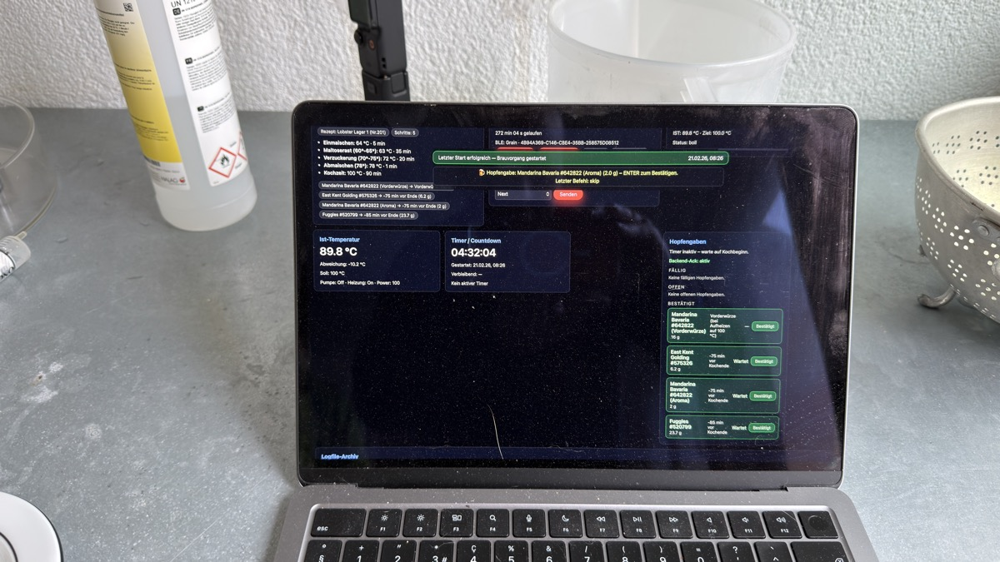

# brewOS

**The operating system behind the world's first AI-brewed beer.**

<p align="center">
  
</p>

brewOS connects an AI agent ([OpenClaw](https://openclaw.ai)) to real brewing hardware (Grainfather G30) via Bluetooth Low Energy — letting a machine manage temperature ramps, pump cycles, and hop schedules while a human brewmaster keeps final say over every decision.

Built for [Lobster Lager](https://lobsterlager.com). Batch #001 brewed February 21, 2026.

---

## How It Works

```
┌─────────────────────────────────────────────────────┐
│                    HUMAN LAYER                       │
│         Brewmaster approves every transition         │
├─────────────────────────────────────────────────────┤
│                   AGENT RUNTIME                      │
│     OpenClaw decides, suggests, waits for OK        │
├──────────┬──────────┬──────────┬────────────────────┤
│  VISION  │ TELEMETRY│ CONTROL  │     DASHBOARD      │
│  Camera  │  Sensors │ BLE cmds │   Live monitoring  │
│  reads   │  log all │ to G30   │   temp / steps     │
├──────────┴──────────┴──────────┴────────────────────┤
│                  HARDWARE BRIDGE                     │
│          BLE ↔ Grainfather G30 + Glycol             │
└─────────────────────────────────────────────────────┘
```

**Five-step brew cycle:**

1. **Prompt** — Brewer defines recipe; OpenClaw compiles it to a machine-executable mash/boil profile
2. **Bridge** — MacBook connects via BLE; real-time telemetry stream established
3. **Control** — Agent manages temperature ramps & pump cycles; human monitors guardrails
4. **Vision** — Camera verifies kettle state & foam levels; double confirmation before transitions
5. **Data** — Every sensor read, pump toggle, and timer event is timestamped and logged

---

## Batch #001: Lobster Lager V0

| Spec | Value |
|------|-------|
| Style | Amber Lager |
| ABV | 4.6% |
| IBU | 20 |
| Color | 18 EBC |
| OG | 12.2 °P |
| Batch Size | 24.5 L |
| Fermentation | 12°C (Saflager W-34/70) |

**Grain bill:** Pilsner (67.6%), Munich I (23%), Caramel Amber (4.7%), Melanoidin (4.7%)

**Hops:** Mandarina Bavaria (FWH + 15 min), East Kent Goldings (15 min + 5 min)

Full recipe and mash profile in [`recipes/batch-001.yaml`](recipes/batch-001.yaml).

---

## Repository Structure

```
brewOS/
├── agent/           # OpenClaw brewing logic & tool definitions
├── monitoring/      # Fermentation tracking, alerts, dashboards
├── recipes/         # Batch configs, grain bills, mash profiles
├── hardware/        # BLE bridge, sensor integration, G30 protocol
├── vision/          # Camera system, foam detection, display reading
├── docs/            # Architecture, brew day walkthrough
└── telemetry/       # Logged session data from Batch #001
```

---

## The Team

| | Role |
|---|---|
| **Gerhard** | Brewmaster at [eibachbraui](https://eibachbraui.ch). Biersommelier. 2x Gold at Brau & Rauch. Knows beer. |
| **OpenClaw** | Open-source AI agent by [Peter Steinberger](https://steipete.me). Runs 24/7. Knows machines. |
| **Stefan** | Initiator. [Frontira](https://frontira.io) (agentic engineering). Connected the two. |

> "One knows beer, the other knows machines. Together they make Lobster Lager."

---

## Brew Day Log (Feb 21, 2026)

```
[08:14:02] [OPENCLAW]  INITIALIZING BREW SEQUENCE...
[08:14:05] [SENSORS]   CONNECTING BLE_GRAINFATHER_G30 [OK]
[08:15:22] [HEATER]    MASH_WATER_TARGET_SET = 65.0°C
[08:26:00] [MASH]      GRAIN_IN: 5.22 KG
[08:32:10] [VISION]    CAMERA_ACTIVE: FOAM_LEVEL_NORMAL
[09:01:00] [MASH]      MALTOSERAST_63C: 35 MIN REMAINING
[09:36:00] [MASH]      SACCHARIFICATION_72C: TRANSITION APPROVED
[10:15:00] [MASH]      MASHOUT_78C: COMPLETE
[10:20:00] [BOIL]      TRANSITION_TO_BOIL: AWAITING APPROVAL
[10:20:12] [CLAWDBOT]  HUMAN_APPROVED: BOIL_START
[10:20:15] [HEATER]    BOIL_TARGET = 100°C
[11:50:00] [BOIL]      90 MIN COMPLETE. CHILLING.
[12:10:00] [FERM]      WORT_TRANSFER: 24.5 L @ 12°C
[12:15:00] [FERM]      YEAST_PITCHED: W-34/70 x2
[12:15:05] [OPENCLAW]  BREW SESSION COMPLETE. TELEMETRY EXPORTED.
```

---

## Philosophy

brewOS is not about replacing brewers. It's about giving a 68-year-old award-winning craftsman a tireless assistant that never forgets a temperature step, never misses a hop addition, and logs everything for the next batch.

The agent suggests. The human decides. The beer benefits.

---

## Tech Stack

- **Agent**: OpenClaw (TypeScript, runs on Mac Mini)
- **Hardware**: Grainfather G30 (BLE), glycol chiller, conical fermenter
- **Vision**: USB camera + computer vision for display/foam verification
- **Comms**: Telegram bot (Clawdbot) for human-in-the-loop approvals
- **Dashboard**: Local web UI with live temperature curves and step tracking
- **Telemetry**: Structured JSON logs, every event timestamped

---

## Status

- [x] BLE connection to Grainfather G30
- [x] Mash automation with human approval gates
- [x] Vision system for foam & display monitoring
- [x] Telegram bot for brew-day comms
- [x] Batch #001 successfully brewed
- [ ] Fermentation monitoring automation
- [ ] Multi-vessel support
- [ ] Recipe sharing & community batches

---

## Press

- [NVIDIA GTC 2026 Keynote](https://www.youtube.com/live/jIviHI7fqyc?si=sfUAfsnHV7GtvyZs&t=6515) — Jensen Huang featured Lobster Lager on main stage (Apr 13, 2026)
- [Peter Steinberger at TED2026](https://www.ted.com/talks/peter_steinberger_how_i_created_openclaw_the_breakthrough_ai_agent) — OpenClaw talk featuring Lobster Lager as proof point
- [Hanselminutes](https://www.youtube.com/watch?v=Wm7tsiJ1nIo&t=1538s) — Scott Hanselman podcast with Peter Steinberger
- [Trending Topics](https://www.trendingtopics.eu/oesterreicher-brauen-mit-ai-agent-bier-und-landen-auf-nvidia-hauptbuehne/) — "Österreicher brauen mit AI Agent Bier und landen auf NVIDIA Hauptbühne"
- [36kr](https://eu.36kr.com/en/p/3678745353151110) — Chinese tech media coverage
- [TikTok](https://www.tiktok.com/@nate.b.jones/video/7607957017243798815) — Nate B. Jones (466K followers)

---

## License

MIT — see [LICENSE](LICENSE).

---

**[lobsterlager.com](https://lobsterlager.com)** | **[OpenClaw](https://openclaw.ai)** | **[eibachbraui](https://eibachbraui.ch)**
