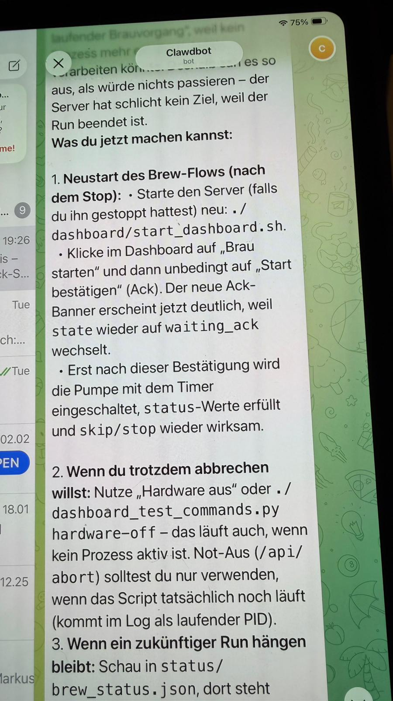

# Agent



OpenClaw brewing logic — the decision engine that turns a recipe into hardware commands.

## Responsibilities

- Parse recipe YAML into executable mash/boil/fermentation profiles
- Manage state machine transitions (preheat → mash → boil → chill → ferment)
- Request human approval at critical gates via Clawdbot (Telegram)
- Handle error states (sensor dropout, BLE disconnect, temp overshoot)

## Human-in-the-Loop

Every state transition requires explicit human approval. The agent suggests, the brewmaster decides.

```
[OPENCLAW] Ready to transition: MASH → BOIL. Approve? [Y/N]
[CLAWDBOT] → Gerhard via Telegram
[GERHARD]  ✓ Approved
[OPENCLAW] BOIL_START confirmed. Heating to 100°C.
```
